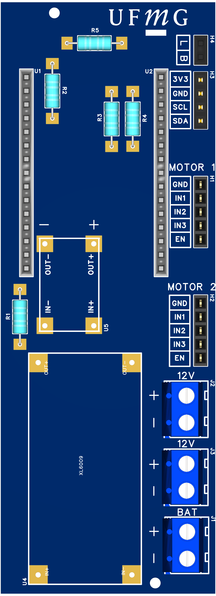
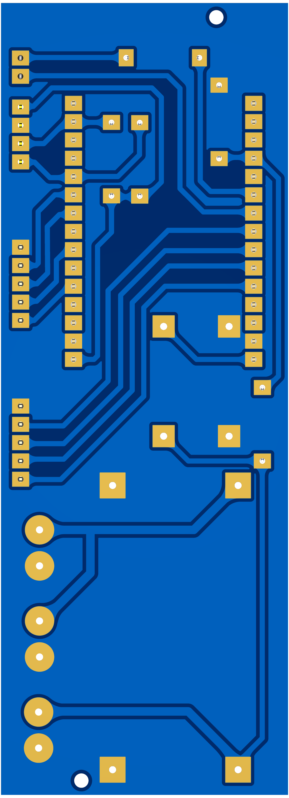

# 🚁 Gimbal Estabilizador IoT de 2 Eixos (ESP32)


Este repositório contém o código-fonte do sistema embarcado e da interface de supervisão para um **Gimbal de 2 Eixos** (Pitch e Roll). O projeto foi desenvolvido com foco em **Automação em Tempo Real** e **Projeto de Sistemas Embutidos**, utilizando o microcontrolador ESP32.

O sistema combina controle vetorial de motores (FOC), fusão sensorial via Filtro de Kalman e comunicação IoT segura via MQTT.

---

## 📂 Estrutura do Repositório

O projeto está dividido em duas partes principais:

1.  **`main/` & `components/`**: Firmware do ESP32 (C/C++ com ESP-IDF).
2.  **`Interface/`**: Interface Desktop de Supervisão (Python + Flet).

---

## 🌟 Funcionalidades do Firmware

* **Real-Time Control:** Laço PID determinístico rodando a **200Hz (5ms)**, priorizado via FreeRTOS.
* **SimpleFOC:** Controle vetorial (SVPWM) para motores Brushless (BLDC), garantindo movimentos suaves.
* **Sensor Fusion:** Utiliza o **Filtro de Kalman**.
* **IoT & MQTT:** Telemetria de ângulos/bateria e recebimento de setpoints remotos via MQTT com suporte a TLS.
* **Multitarefa:** Arquitetura baseada em Tasks, Filas, Mutexes e Semáforos para evitar *race conditions*.
* **Ambiente Reprodutível:** Suporte nativo a **Docker (Dev Containers)**.

---

## 🛠️ Hardware e Pinagem

O firmware está configurado para o seguinte mapeamento de IOs no ESP32 (DevKit V1):

* **Microcontrolador:** ESP32 (DevKit V1 ou similar).
* **Sensores:** MPU6050 (Acelerômetro + Giroscópio).
* **Atuadores:** 2x Motores Brushless (Gimbal Motors) + Drivers (SimpleFOC Mini v1.0).
* **Alimentação:** Bateria Li-Ion 2S (7.4V).
* **Conversores:** Buck Mini360 e Boost XL6009.
* **Conexões (Pinout Padrão):**

| Componente | Pinos ESP32 | Função | Detalhes |
| :--- | :--- | :--- | :--- |
| **I2C Bus** | GPIO 21 (SDA), 22 (SCL) | Comunicação | Sensor MPU6050 (Endereço 0x68) |
| **Motor Pitch** | GPIO 19, 18, 17 | PWM (Fases A/B/C) | SimpleFOC Mini v1.0 |
| **Motor Roll** | GPIO 25, 26, 27 | PWM (Fases A/B/C) | SimpleFOC Mini v1.0 |
| **Enable Motores**| GPIO 4 (Pitch), 14 (Roll)| Digital Out | Habilita os Drivers |
| **Bateria** | GPIO 34 | Analog In (ADC) | Divisor de Tensão (Leitura 2S) |
| **Botão** | GPIO 33 | Digital In (ISR) | Botão físico com Pull-up |
| **LED Status** | GPIO 32 | Digital Out | Indicação de Bateria |

### 🖨️ Placa de Circuito Impresso (PCB)
Foi desenvolvida uma PCB dedicada para garantir a robustez mecânica do gimbal. O projeto inclui regulação de tensão e conectores modulares.

| Vista Superior (Top) | Vista Inferior (Bottom) |
| :---: | :---: |
|  |  |

> **Nota:** O projeto da PCB foi realizado no EasyEDA e os arquivos de fabricação (Gerber) podem ser solicitados ou encontrados na pasta `hardware/`.

---

## 📂 Estrutura do Projeto

O código foi organizado de forma modular para facilitar a manutenção e testabilidade:

```text
├── assets/              # Imagens da placa PCB e Esquematico
├── hardware/            # Arquivos Gerber (PCB)
├── components/          # Bibliotecas externas (I2Cdev, MPU6050)
├── main/
│   ├── BATERIA/         # Leitura ADC e filtro de média móvel
│   ├── BOTAO/           # Tratamento de interrupção e debounce
│   ├── BUFFER/          # Buffer circular (Produtor-Consumidor)
│   ├── LOGGER/          # Sistema de logs híbrido (Serial/MQTT)
│   ├── MPU6050/         # Abstração do driver e gestão do Filtro de Kalman
│   ├── PID/             # Algoritmo de controle e SimpleFOC
│   ├── WIFI_MQTT/       # Gestão de conexão e protocolo IoT
│   ├── main.c           # Inicialização e orquestração de Tasks
│   └── mainGlobals.h    # Mutexes, Semáforos e Variáveis Globais
├── .devcontainer/       # Configuração para ambiente Docker
├── Interface/           # Interface em Flet
└── CMakeLists.txt       # Configuração de build
```

## 🚀 Guia de Compilação (Firmware)

### Pré-requisitos
* **ESP-IDF v5.5.1** (Versão recomendada).
* Driver USB do ESP32 (CP210x ou CH340).

### Opção A: Usando Docker (Recomendado)
Este repositório inclui a pasta `.devcontainer`. Se você usa VS Code:
1.  Instale a extensão **Dev Containers**.
2.  Abra a pasta do projeto e clique em **"Reopen in Container"**.
3.  O ambiente será montado automaticamente com todas as ferramentas.
4.  Compile:
    ```bash
    idf.py build
    ```

### Opção B: Instalação Manual (Nativa)
1.  Instale o ESP-IDF v5.5.1.
2.  Baixe a dependência do SimpleFOC:
    ```bash
    idf.py add-dependency "espressif/esp_simplefoc^1.2.1"
    ```
3.  **Configuração Crítica (Kernel):**
    * Execute `idf.py menuconfig`.
    * Vá em `Component config` → `FreeRTOS` → `Kernel`.
    * Altere `configTICK_RATE_HZ` para **1000** (1kHz). *Isso é essencial para o loop de 5ms funcionar corretamente.*

### Configuração de Rede (Wi-Fi e MQTT)
⚠️ **Atenção:** As credenciais não estão versionadas por segurança. Edite antes de compilar:
1.  **Wi-Fi:** `main/WIFI_MQTT/wifi_sta.c` (SSID e Senha).
2.  **MQTT:** `main/WIFI_MQTT/mqtt_esp32.c` (URI do Broker, Usuário e Senha).

### Gravando e Monitorando
Conecte o ESP32 via USB e execute:
```bash
# Substitua COMx pela sua porta (ex: COM3 ou /dev/ttyUSB0)
idf.py -p COMx flash monitor
```

---

## 📦 Arquitetura de Software (Firmware)

O código segue uma estrutura modular para facilitar a manutenção:

* **`main/PID/`**: Lógica de controle e interface com SimpleFOC.
* **`main/MPU6050/`**: Driver do sensor e gestão do Filtro de Kalman.
* **`main/BUFFER/`**: Buffer circular para desacoplar a leitura do sensor (rápida) do envio MQTT (lento).
* **`main/WIFI_MQTT/`**: Gerenciamento de conexão assíncrona.
* **`main/LOGGER/`**: Redirecionamento de logs (Serial + MQTT).

---

## 🖥️ Interface Desktop

A interface gráfica permite visualizar a telemetria e enviar comandos. O código Python encontra-se na pasta `Interface/`.

### Estrutura da Interface

- **`main.py`**: Ponto de entrada. Inicializa o Flet e o processo MQTT.
- **`GUI/app.py`**: Constrói a UI (Sliders, Gráficos, Cards de Telemetria).
- **`favoritos.xlsx`**: Armazenamento local de posições salvas.
- **`MQTT/`**: Módulo de comunicação.
  - `config.py`: Configurações do Broker e Tópicos.
  - `cliente.py`: Cliente Paho-MQTT com lógica de debounce.
  - `mqtt_process.py`: Processo em background para não travar a GUI.
  - `mqtt_logger.py`: Utilitário para salvar logs em CSV.

### Como Rodar a Interface

**Requisitos:** Python 3.10+ e `pip`.

1.  Acesse a pasta da interface:
    ```bash
    cd Interface
    ```
2.  Crie e ative um ambiente virtual (recomendado):
    ```bash
    python -m venv .venv
    # Windows:
    .\.venv\Scripts\activate
    # Linux/Mac:
    source .venv/bin/activate
    ```
3.  Instale as dependências:
    ```bash
    pip install -r requirements.txt
    ```
    *(Conteúdo do requirements.txt: `flet`, `paho-mqtt`, `openpyxl`)*

4.  Execute a aplicação:
    ```bash
    python main.py
    ```

---

## 👏 Créditos e Bibliotecas

Este projeto utiliza ferramentas de código aberto robustas. Agradecimentos especiais aos desenvolvedores de:

* **[SimpleFOC](https://simplefoc.com/)**: Biblioteca de controle vetorial (FOC) para Arduino/ESP32, mantida por Antun Skuric e comunidade.
* **[I2Cdev / MPU6050](https://github.com/jrowberg/i2cdevlib)**: Driver original de Jeff Rowberg e porta para ESP32 por ElectronicCats.
* **[Flet](https://flet.dev/)**: Framework Python utilizado para a construção da interface gráfica moderna e reativa.
* **[ESP-IDF](https://docs.espressif.com/projects/esp-idf/en/latest/esp32/)**: Framework de desenvolvimento IoT oficial da Espressif.

## 📝 Licença e Autores

Projeto desenvolvido como requisito das disciplinas de **Automação em Tempo Real** e **Projeto de Sistemas Embutidos (UFMG)**.