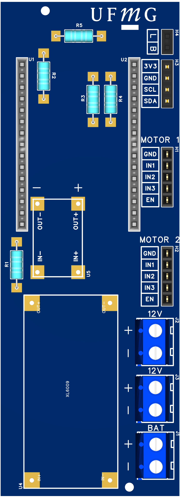
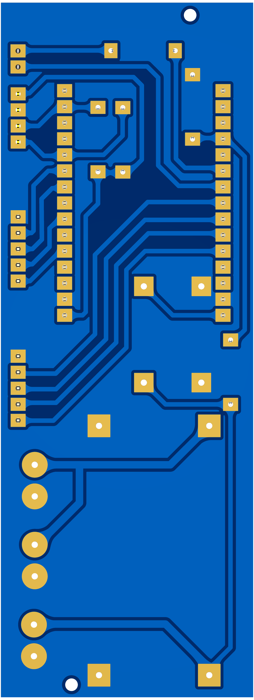

# 📷 IoT 2-Axis Gimbal Stabilization System (ESP32)


<p align="center">
  
</p>

This repository contains the firmware for the embedded system and the supervisory interface for a **2-Axis Gimbal** (Pitch and Roll). The project was developed with a focus on **Real-Time Automation** and **Embedded Systems**, using the **ESP32** microcontroller.

The system combines **Field Oriented Control** (FOC), Sensor Fusion via **Kalman Filter**, and secure IoT communication over **MQTT**.

---

## 📂 Repository Structure

The repository is organized in a modular way to facilitate maintenance and testing:

```text
├── assets/              # PCB Design and Schematics
├── hardware/            # Gerber Files (PCB Manufacturing)
├── components/          # External Libraries (I2Cdev, MPU6050)
├── main/
│   ├── BATERIA/         # ADC Reading and Moving Average Filter
│   ├── BOTAO/           # Interrupt Handling and Debounce
│   ├── BUFFER/          # Circular Buffer (Producer-Consumer)
│   ├── LOGGER/          # Hybrid Logging System (Serial/MQTT)
│   ├── MPU6050/         # Driver Abstraction and Kalman Filter
│   ├── PID/             # Control Algorithm and SimpleFOC
│   ├── WIFI_MQTT/       # Connection Management and IoT Protocol
│   ├── main.c           # System Initialization and Task Orchestration
│   └── mainGlobals.h    # Mutexes, Semaphores and Global Variables
├── .devcontainer/       # Docker Environment Configuration
├── Interface/           # Flet Interface (Python)
└── CMakeLists.txt       # Build Configuration
```

---

## 🌟 Firmware Features

* **Real-Time Control:** Deterministic **PID loop** running at **200Hz (5ms)**, prioritized via FreeRTOS.
* **SimpleFOC:** Vector Control (SVPWM) for Brushless motors (BLDC), ensuring smooth motion.
* **Sensor Fusion:** Implemented via **Kalman Filter**.
* **IoT & MQTT:** Telemetry (Angle/Battery) and remote setpoint reception over MQTT with TLS support.
* **Multitasking:** Architecture based on Tasks, Queues, Mutexes and Semaphores to prevent *race conditions*.
* **Reproducible Environment:** Native support for **Docker (Dev Containers)**.

## 🧠 Technical Challenges & Control Strategy

**Overcoming Sensor Latency:**
Initially, the system relied on the MPU6050’s internal Digital Motion Processor (DMP) to obtain pitch and roll angles. However, the DMP introduced processing delays that restricted the control bandwidth. This latency prevented us from increasing the PID gains without pushing the system into instability, resulting in a sluggish motor response. 

To solve this, we bypassed the DMP entirely. By implementing a custom **Kalman Filter** directly on the raw accelerometer and gyroscope data, we drastically reduced latency and increased the sampling rate. This software solution allowed for higher PID gains, yielding a much faster and more aggressive system response.

**Mechanical Resonance & Structural Flexibility:**
During high-frequency operation, we identified a mechanical limitation. The 3D-printed ABS arms exhibited structural flexibility, essentially acting as a mass-spring (second-order) system. When the motors accelerated rapidly to correct large errors, the arms vibrated. While the control loop was robust enough to stabilize the gimbal, this mechanical resonance lowered the overall margin of stability. This highlighted the crucial relationship between rigid mechanical design and high-frequency control loops.

---

## 🛠️ Hardware and Pinout

The firmware is configured with the **following** pin assignment for the ESP32 (DevKit V1):

* **Microcontroller:** ESP32 (DevKit V1 or similar).
* **Sensors:** MPU6050 (Accelerometer + Gyroscope).
* **Actuators:** 2x Brushless Motors (Gimbal Motors) + 2x Drivers (SimpleFOC Mini v1.0).
* **Power Supply:** Li-Ion Battery 2S (7.4V).
* **Converters:** Buck Mini360 and Boost XL6009.
* **Connections (Default Pinout):**

| Component | ESP32 Pin | Function | Details |
| :--- | :--- | :--- | :--- |
| **I2C Bus** | GPIO 21 (SDA), 22 (SCL) | Communication | MPU6050 Sensor (Address 0x68) |
| **Pitch Motor** | GPIO 19, 18, 17 | PWM (Phases A/B/C) | SimpleFOC Mini v1.0 |
| **Roll Motor** | GPIO 25, 26, 27 | PWM (Phases A/B/C) | SimpleFOC Mini v1.0 |
| **Motor Enable**| GPIO 4 (Pitch), 14 (Roll)| Digital Out | Driver Enable Signal |
| **Battery** | GPIO 34 | Analog In (ADC) | Voltage Divider (2S Monitoring) |
| **Button** | GPIO 33 | Digital In (ISR) | Physical Button with Pull-up |
| **Status LED** | GPIO 32 | Digital Out | Battery Indicator |

### 🖨️ Printed Circuit Board (PCB)

A dedicated PCB was developed to ensure **mechanical robustness** for the Gimbal assembly. The **design includes** onboard voltage regulation and modular connectors.

| Top View | Bottom View |
| :---: | :---: |
|  |  |

> **Note:** The PCB was designed using **EasyEDA**. Manufacturing files (Gerbers) can be found in the `hardware/` folder.

## 🚀 Compilation Guide (Firmware)

### Prerequisites
* **ESP-IDF v5.5.1** (Recommended Version).
* ESP32 USB Driver (CP210x or CH340).

### Option A: Docker (Recommended)
This repository includes a `.devcontainer` configuration. If you are using VS Code:
1.  Install the **Dev Containers** extension.
2.  Open the project folder and click on **"Reopen in Container"**.
3.  The environment will be set up automatically with all necessary tools.
4.  Compile:
    ```bash
    idf.py build
    ```

### Option B: Manual Installation (Native)
1.  Install the ESP-IDF v5.5.1.
2.  Download the SimpleFOC dependency:
    ```bash
    idf.py add-dependency "espressif/esp_simplefoc^1.2.1"
    ```
3.  **Critical Configuration (Kernel):**
    * Execute `idf.py menuconfig`.
    * Navigate to `Component config` → `FreeRTOS` → `Kernel`.
    * Change `configTICK_RATE_HZ` to **1000** (1kHz). *This is essential for the main loop (5ms) to run correctly.*

### Network Configuration (Wi-Fi and MQTT)
⚠️ **Warning:** Security credentials are not version-controlled (ignored by git). Please update the following files before compiling: 

1.  **Wi-Fi:** `main/WIFI_MQTT/wifi_sta.c` (SSID and Password).
2.  **MQTT:** `main/WIFI_MQTT/mqtt_esp32.c` (Broker URI, Username and Password).

### Flashing and Monitoring
Connect the ESP32 via USB and run:
```bash
# Replace COMx with your specific port (e.g., COM3 or /dev/ttyUSB0)
idf.py -p COMx flash monitor
```

---

## 🖥️ Desktop Interface

The Graphics User Interface (UI) allows you to visualize telemetry data and send control commands. The Python source code is located in the `Interface/` folder.

### Interface Structure

- **`main.py`**: Entry Point. Initializes Flet and MQTT process.
- **`GUI/app.py`**: Builds the UI (Sliders, Charts, Telemetry Cards).
- **`favoritos.xlsx`**: Local storage for saved positions.
- **`MQTT/`**: Communication Module.
  - `config.py`: Broker and Topic Configurations.
  - `cliente.py`: Paho-MQTT Client with debounce logic.
  - `mqtt_process.py`: Background process to prevent GUI freezing.
  - `mqtt_logger.py`: Utility for saving logs to CSV.

### Running the Interface

**Prerequisites:** Python 3.10+ and `pip`.

1.  Navigate to the interface folder:
    ```bash
    cd Interface
    ```
2.  Create and activate a virtual environment (recommended):
    ```bash
    python -m venv .venv
    # Windows:
    .\.venv\Scripts\activate
    # Linux/Mac:
    source .venv/bin/activate
    ```
3.  Install dependencies:
    ```bash
    pip install -r requirements.txt
    ```
    *(requirements.txt content: `flet`, `paho-mqtt`, `openpyxl`)*

4.  Run the application:
    ```bash
    python main.py
    ```

---

## 👏 Credits and Acknowledgments

This project uses robust open-source tools. Special thanks to the developers of:

* **[SimpleFOC](https://simplefoc.com/)**: Vector Control Library (FOC) for Arduino/ESP32, maintained by Antun Skuric and the community.
* **[I2Cdev / MPU6050](https://github.com/jrowberg/i2cdevlib)**: Jeff Rowberg’s original driver and ports for ESP32 by ElectronicCats.
* **[Flet](https://flet.dev/)**: Python Framework used to build a modern and reactive Desktop Interface.
* **[ESP-IDF](https://docs.espressif.com/projects/esp-idf/en/latest/esp32/)**: Espressif’s Official IoT Development Framework.

## 📝 License and Authors

This project was developed as a requirement for the **Real-Time Automation** and **Embedded Project Design** courses at the **Universidade Federal de Minas Gerais (UFMG)**.
